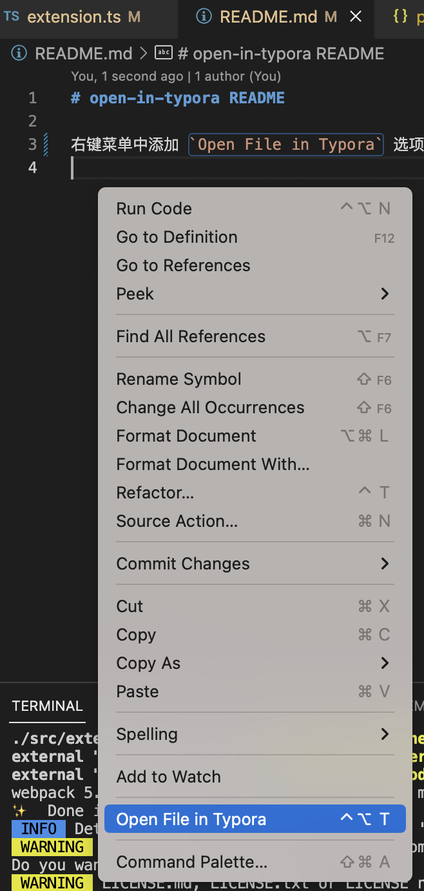

# open-in-typora

## 安装脚手架

```bash
npm install -g yo
npm install -g generator-code
```

## 创建项目

```bash
yo code
```


## 编写插件

参考 [指引](vsc-extension-quickstart.md)

## 调试

```bash
# 编译
npm run compile

# 编译并开启监听的话，下面按 F5 没有任何反应。。。无语的bug
# npm run watch
```

按 `F5` 开始调试，会新开一个vscode实例

## 打包

输出 dist 文件夹

```bash
npm run package
```

安装打包工具

```bash
npm install -g @vscode/vsce
```

修改 README.md 文件，内容为插件使用说明，图片链接不能是相对路径，必须是 http 链接，否则下面的命令会报错

生成 vsix 文件

```bash
vsce package
```

## 本地安装




